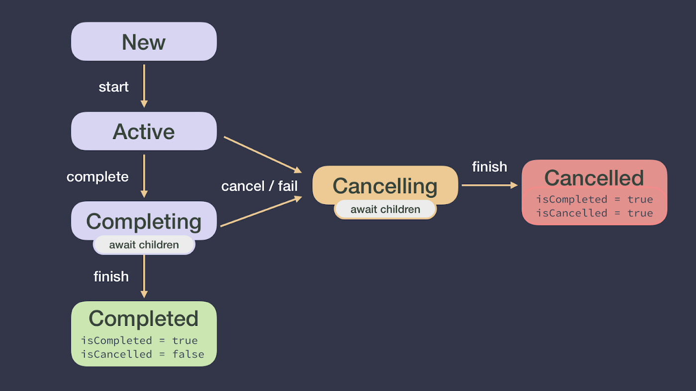

## 코루틴 공식문서. [Cancellation and timeouts](https://kotlinlang.org/docs/cancellation-and-timeouts.html)

### 공부를 통해 얻고자 하는 것
- 코루틴 실행 취소 / 타임아웃 시 예외처리 방법에 대해 알 수 있다.



## Cancelling coroutine exception
- 실행중인 코루틴을 취소할 수 있다.
- `Job` object로 실행중인 코루틴 취소
```kotlin
fun main() = runBlocking {
    val job = launch {
        repeat(1000) { i ->
            println("[job] $i")
            delay(500)
        }
    }

    delay(1000)
    println("[main] waiting")
    job.cancel()    // 실행중인 코루틴 취소
    job.join()
    println("[main] finished")
}
```

- 아래 예제에서는 Job을 취소해도 코루틴 취소를 확인하지 않기 때문에 5번의 반복이 모두 실행된 후에 코루틴이 종료된다. 
```kotlin
fun main() = runBlocking {
    val startTime = System.currentTimeMillis()
    val job = launch(Dispatchers.Default) {
        var nextPrintTime = startTime
        var i = 0
        while ( i < 5) {    // cancel() 이후에도 수행된다. isActive 로 코루틴 실행 확인
            if (System.currentTimeMillis() >= nextPrintTime) {
                println("[job] ${i++}")
                nextPrintTime += 500L
            }
        }
    }

    delay(1000)
    println("[main] waiting")
    job.cancelAndJoin()
    println("[main] finished")
}
```

- 코루틴이 취소된 후에 종료 작업을 실행한다. (finally)
```kotlin
fun main() = runBlocking {
    val job = launch {
        try {
            repeat(100) { i ->
                println("[job] $i")
                delay(500)
            }
        } catch (e: CancellationException) {
            println("exception")
        } finally {
            println("canceled")
        }
    }

    delay(1000)
    println("[main] waiting")
    job.cancelAndJoin()
    println("[main] finished")
}
```

- 취소된 코루틴을 일시정지 하고 싶을 때 `withContext`를 활용할 수 있다. 
```kotlin
val job = launch {
    try {
        repeat(1000) { i ->
            println("job: I'm sleeping $i ...")
            delay(500L)
        }
    } finally {
        withContext(NonCancellable) {
            println("job: I'm running finally")
            delay(1000L)
            println("job: And I've just delayed for 1 sec because I'm non-cancellable")
        }
    }
}
delay(1300L) // delay a bit
println("main: I'm tired of waiting!")
job.cancelAndJoin() // cancels the job and waits for its completion
println("main: Now I can quit.")
```

### Timeout
- 코루틴 수행이 일정 시간을 초과하는 경우 timeout을 발생시킬 수 있다.
- `withTimeout`으로 지정한 시간을 초과하면 `TimeoutCancellationException`을 발생시킨다.
```kotlin
fun main() = runBlocking {
    val result = withTimeout(3000) {    // withTimeoutNull : 타임아웃 발생 시 null 반환
        repeat(1000) { i ->
            println("[job] $i")
            delay(100)
        }
    }
    println(result)
}
```

- `Keep this in mind if you open or acquire some resource inside the block that needs closing or release outside of the block.`
```kotlin
fun main() {
    runBlocking {
        repeat(10_000) { i -> // 100,000 코루틴
            launch {
                var resource: Resource? = null
                try {
                    // launch 코루틴 안에서 TimeoutCancellationException 발생
                    withTimeout(25) {    // Timeout 30 ms
                        delay(10)
                        resource = Resource()
                    }
                } finally {
                    // TimeoutCancellationException 발생 후 종료 작업에서 close 처리
                    resource.close()    // release Resource
                }
            }
        }
    }

    // runBlocking 완료
    println(acquired)
}
```
